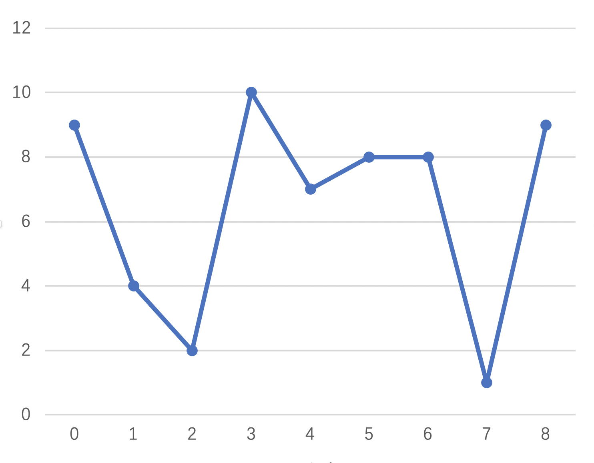

## 978. 最长湍流子数组

*题目描述*

>
> 
> 当 `A` 的子数组 `A[i], A[i+1], ..., A[j]` 满足下列条件时，我们称其为*湍流子数组*：
>
> - 若 `i <= k < j`，当 `k` 为奇数时， `A[k] > A[k+1]`，且当 `k` 为偶数时，`A[k] < A[k+1]`；
> - 或 若 `i <= k < j`，当 `k` 为偶数时，`A[k] > A[k+1]` ，且当 `k` 为奇数时， `A[k] < A[k+1]`。
>
> 也就是说，如果比较符号在子数组中的每个相邻元素对之间翻转，则该子数组是湍流子数组。
>
> 返回 `A` 的最大湍流子数组的长度。

*题解1*

> 
>
> 如图所示，最大湍流子数组的长度就是连续极值的个数，注意边界情况，第一个节点和最后一个节点可以不是极值也计算在内。

